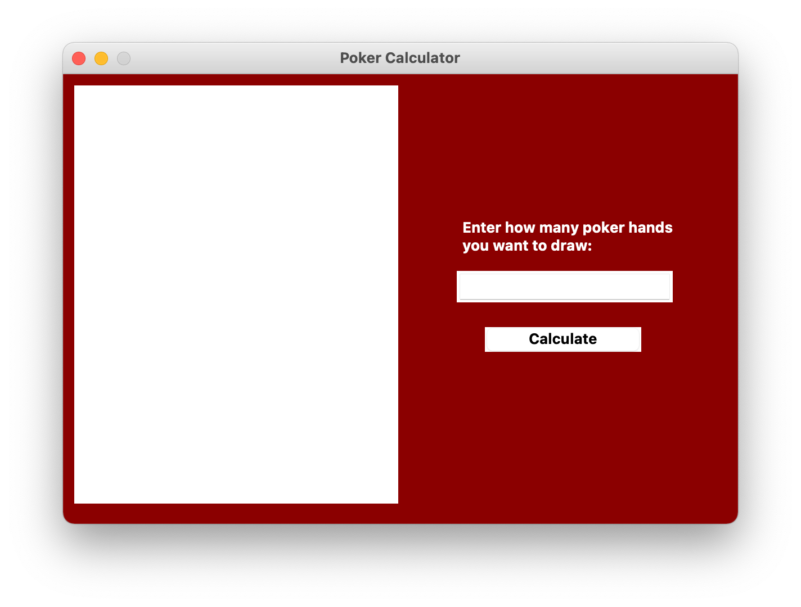
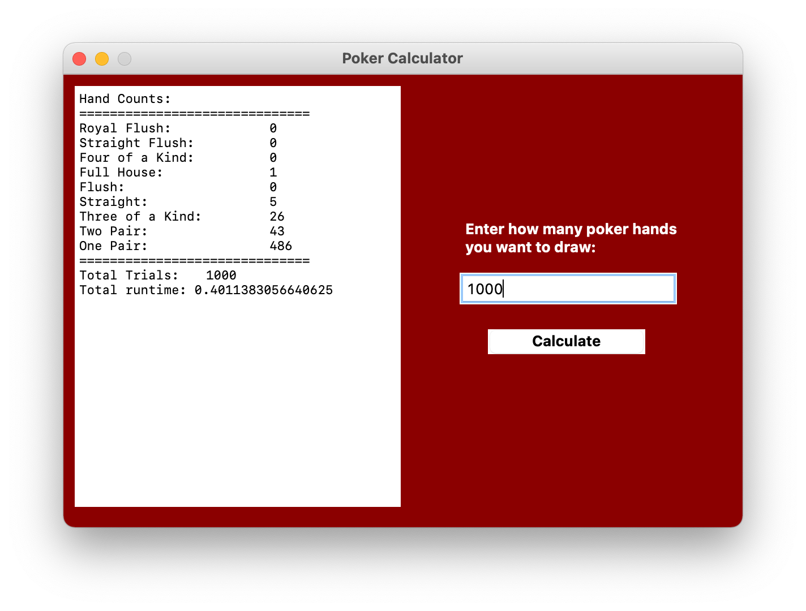

# Purpose
This program asks you to enter how many different poker hands you want to draw from a deck of cards

It will then calculate of those hands how many were a one pair, two pair, ..., royal flush.

In the end it prints out how many times each card combination happened

# Images
### Program load, empty form

### First run of program with 1000 trials

### Second run with 50000 trials (including previous 1000 hence 51000). Note the runtime

# Libraries used
- `tkinter`, displays program window and UI
- `random`, shuffles deck
- `copy`, creates a copy of the deck for reshuffling
- `defaultdict`, used for creating dictionaries with default values when calculating hand combinations
- `json`, saving and loading data to and from a json file

# Files
- `main.py` - houses core logic
- `deck.py` - manages cards in the deck and related functions that are more verbatim
- `check.py` - manages functions that calculate what hand combinations exist in a hand
- `count_tk` - manages outputting, saving, and loading data

# How it works
The program begins in main.py

As for the user it begins when they enter a number value in the input box, `txt_trials`
 
Then hit the submit button, `btn_calculate`. This can call 1 of 2 functions:

- `click()`, main function housing core logic
- `test()`, can be used to manually test card combinations

# Data carryover
If you want to retain data between runs of the program go to count_tk.py

Inside `__init__()`, there is a call to a function `self.reset()`

If `reset()` is **commented**, data between program runs will carry over

If `reset()` is **uncommented**, data will reset each time the program runs
        
# Backstory
This was my first python project. 
My goal was to use all the fundamentals I learned and build something with it

Ive always loved playing cards. 
I thought that a project concerning them would be a great opportunity to practice algorithmic thinking as well

I decided on making a poker related project because I was playing it with my friends at the time for fun at home

I was interested in finding out how often rare hand combinations, like royal flush, occur in comparison to common combinations, like one pair.
